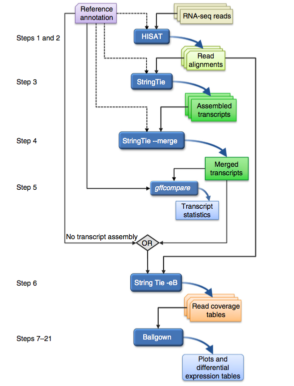

# 有参考基因组，但需要组装新的转录本  

## 总流程说明  

`HISAT2` -> `StringTie` -> `Ballgown`  

本试验流程主要参考文献：[Transcript-level expression analysis of RNA-seq experiments with HISAT, StringTie and Ballgown.](http://www.nature.com/nprot/journal/v11/n9/full/nprot.2016.095.html)  



## 上机操作  

说明：结果文件放到`result/01.hisat`目录中。  
 
```
$ cd result
$ mkdir 01.hisat
$ mkdir 01.hisat/db

```

**STEP1: 参考基因组建索引**  

>**运行时间：~5 min**

```
$ cd 01.hisat/db/
$ ln -s /bs1/data/NGS/data/ref/genome.fa ./
$ hisat2-build genome.fa genome
```
建完索引后会生成几个索引文件  
```
$ ls -l
-rw-rw-r--. 1 public public 31720791 11月  8 08:12 genome.1.ht2
-rw-rw-r--. 1 public public 20523760 11月  8 08:12 genome.2.ht2
-rw-rw-r--. 1 public public    85850 11月  8 08:10 genome.3.ht2
-rw-rw-r--. 1 public public 20523755 11月  8 08:10 genome.4.ht2
-rw-rw-r--. 1 public public 53804023 11月  8 08:12 genome.5.ht2
-rw-rw-r--. 1 public public 20682414 11月  8 08:12 genome.6.ht2
-rw-rw-r--. 1 public public        8 11月  8 08:10 genome.7.ht2
-rw-rw-r--. 1 public public        8 11月  8 08:10 genome.8.ht2
lrwxrwxrwx. 1 public public       32 11月  8 08:06 genome.fa -> /bs1/data/NGS/data/ref/genome.fa
```
**STEP2: Mapping**

>**运行时间：~4 h**

```
$ cd ../
$ mkdir mapping
$ cd mapping
$ hisat2 -x ../db/genome -1 ../../00.fq/WLD-1.R1.fastq.gz -2 ../../00.fq/WLD-1.R2.fastq.gz -S wild_1.sam 2> wild_1.log
$ hisat2 -x ../db/genome -1 ../../00.fq/WLD-2.R1.fastq.gz -2 ../../00.fq/WLD-2.R2.fastq.gz -S wild_2.sam
$ hisat2 -x ../db/genome -1 ../../00.fq/WLD-3.R1.fastq.gz -2 ../../00.fq/WLD-3.R2.fastq.gz -S wild_3.sam
$ hisat2 -x ../db/genome -1 ../../00.fq/MUT-1.R1.fastq.gz -2 ../../00.fq/MUT-1.R2.fastq.gz -S mutant_1.sam
$ hisat2 -x ../db/genome -1 ../../00.fq/MUT-2.R1.fastq.gz -2 ../../00.fq/MUT-2.R2.fastq.gz -S mutant_2.sam
$ hisat2 -x ../db/genome -1 ../../00.fq/MUT-3.R1.fastq.gz -2 ../../00.fq/MUT-3.R2.fastq.gz -S mutant_3.sam
$ ll ./*.sam
-rw-rw-r--. 1 public public  8058072080 11月  8 12:03 mutant_1.sam
-rw-rw-r--. 1 public public  9937287057 11月  8 12:39 mutant_2.sam
-rw-rw-r--. 1 public public 11189770206 11月  8 13:21 mutant_3.sam
-rw-rw-r--. 1 public public  9324884413 11月  9 10:01 wild_1.sam
-rw-rw-r--. 1 public public 10420117029 11月  8 10:50 wild_2.sam
-rw-rw-r--. 1 public public 10810699663 11月  8 11:30 wild_3.sam
```

从日志文件（\*.log）中提取以下信息：  

Sample | number of reads | number of mapped reads | uniq mapped reads
------ | ------ | ------ | ----
wild_1 |    |   | 
wild_2 |   |  | 
wild_3 |   |  | 
mutant_1 | | | 
mutant_2 | | | 
mutant_3 | | | 


**STEP3: Sort BAM**  

>**运行时间：~3 h**

```
$ samtools view -b wild_1.sam | samtools sort -o wild_1.bam - 
$ samtools view -b wild_2.sam | samtools sort -o wild_2.bam - 
$ samtools view -b wild_3.sam | samtools sort -o wild_3.bam - 
$ samtools view -b mutant_1.sam | samtools sort -o mutant_1.bam - 
$ samtools view -b mutant_2.sam | samtools sort -o mutant_2.bam - 
$ samtools view -b mutant_3.sam | samtools sort -o mutant_3.bam - 
删除中间文件
$ rm *.sam
```

**STEP4: 组装**  

>**运行时间：~1 h**

```
$ cd ../
$ mkdir assem
$ cd assem
$ stringtie -G /bs1/data/NGS/data/ref/gene.gff -o wild_1.gtf -l wild_1 ../mapping/wild_1.bam
$ stringtie -G /bs1/data/NGS/data/ref/gene.gff -o wild_2.gtf -l wild_2 ../mapping/wild_2.bam
$ stringtie -G /bs1/data/NGS/data/ref/gene.gff -o wild_3.gtf -l wild_3 ../mapping/wild_3.bam
$ stringtie -G /bs1/data/NGS/data/ref/gene.gff -o mutant_1.gtf -l mutant_1 ../mapping/mutant_1.bam
$ stringtie -G /bs1/data/NGS/data/ref/gene.gff -o mutant_2.gtf -l mutant_2 ../mapping/mutant_2.bam
$ stringtie -G /bs1/data/NGS/data/ref/gene.gff -o mutant_3.gtf -l mutant_3 ../mapping/mutant_3.bam
合并
$ ls *.gtf > mergelist.txt
$ stringtie --merge -G /bs1/data/NGS/data/ref/gene.gff -o stringtie_merge.gtf mergelist.txt

```

**STEP5: gff compare**  

>**运行时间：~ 2 min**

```
$ mkdir gffcomp
$ gffcompare -T -r /bs1/data/NGS/data/ref/gene.gff -o gffcomp/wild_1 wild_1.gtf
$ gffcompare -T -r /bs1/data/NGS/data/ref/gene.gff -o gffcomp/wild_2 wild_2.gtf
$ gffcompare -T -r /bs1/data/NGS/data/ref/gene.gff -o gffcomp/wild_3 wild_3.gtf
$ gffcompare -T -r /bs1/data/NGS/data/ref/gene.gff -o gffcomp/mutant_1 mutant_1.gtf
$ gffcompare -T -r /bs1/data/NGS/data/ref/gene.gff -o gffcomp/mutant_2 mutant_2.gtf
$ gffcompare -T -r /bs1/data/NGS/data/ref/gene.gff -o gffcomp/mutant_3 mutant_3.gtf
$ gffcompare -T -r /bs1/data/NGS/data/ref/gene.gff -o gffcomp/merged stringtie_merge.gtf
```

结果文件存放在`gffcomp/`目录中。  
```
$ ll gffcomp/
总用量 224472
-rw-rw-r--. 1 public public 45127069 11月 10 17:27 merged.annotated.gtf
-rw-rw-r--. 1 public public  1964885 11月 10 17:27 merged.loci
-rw-rw-r--. 1 public public     1218 11月 10 17:27 merged.stats
-rw-rw-r--. 1 public public  5183261 11月 10 17:27 merged.tracking
-rw-rw-r--. 1 public public 24321868 11月 10 17:28 mutant_1.annotated.gtf
-rw-rw-r--. 1 public public  1430041 11月 10 17:28 mutant_1.loci
-rw-rw-r--. 1 public public     1205 11月 10 17:28 mutant_1.stats
-rw-rw-r--. 1 public public  3242845 11月 10 17:28 mutant_1.tracking
-rw-rw-r--. 1 public public 24387501 11月 10 17:28 mutant_2.annotated.gtf
-rw-rw-r--. 1 public public  1403361 11月 10 17:28 mutant_2.loci
-rw-rw-r--. 1 public public     1205 11月 10 17:28 mutant_2.stats
-rw-rw-r--. 1 public public  3133168 11月 10 17:28 mutant_2.tracking
-rw-rw-r--. 1 public public 25829346 11月 10 17:28 mutant_3.annotated.gtf
-rw-rw-r--. 1 public public  1451284 11月 10 17:28 mutant_3.loci
-rw-rw-r--. 1 public public     1205 11月 10 17:28 mutant_3.stats
-rw-rw-r--. 1 public public  3305759 11月 10 17:28 mutant_3.tracking
-rw-rw-r--. 1 public public 24992318 11月 10 17:28 wild_1.annotated.gtf
-rw-rw-r--. 1 public public  1436529 11月 10 17:28 wild_1.loci
-rw-rw-r--. 1 public public     1199 11月 10 17:28 wild_1.stats
-rw-rw-r--. 1 public public  3312782 11月 10 17:28 wild_1.tracking
-rw-rw-r--. 1 public public 25012577 11月 10 17:28 wild_2.annotated.gtf
-rw-rw-r--. 1 public public  1435038 11月 10 17:28 wild_2.loci
-rw-rw-r--. 1 public public     1199 11月 10 17:28 wild_2.stats
-rw-rw-r--. 1 public public  3235620 11月 10 17:28 wild_2.tracking
-rw-rw-r--. 1 public public 24639874 11月 10 17:28 wild_3.annotated.gtf
-rw-rw-r--. 1 public public  1393727 11月 10 17:28 wild_3.loci
-rw-rw-r--. 1 public public     1199 11月 10 17:28 wild_3.stats
-rw-rw-r--. 1 public public  3151156 11月 10 17:28 wild_3.tracking

```

根据`gffcompare`结果，统计以下信息：  

Sample id | Number of assembled genes | Novel genes | Transcripts matching annotation | Novel transcripts
--- | --- | --- | --- | --- 
wild_1 | | | | 
wild_2 | | | | 
wild_3 | | | | 
mutant_1 | | | | 
mutant_2 | | | | 
mutant_3 | | | | 
merged  | | | | 

**STEP 6: Estimate transcript abundances and create table counts for Ballgown**

```

```
